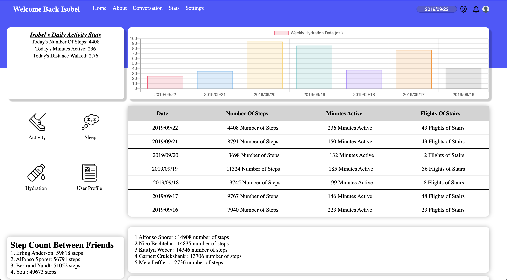

## FitLit 

## Authors

Nathan Darrington [https://github.com/npdarrington]

Taylor Johnson [https://github.com/taylorjohnson141]

## Learning Goals

The Fitlit partner project was intended to help students understand Test Driven Development, how to correctly format/import ES6 Classes how to import Node packages and the difference between Node.js and JS. 

## Setup

Clone Repo
run `npm install` for dependencies
to see project `open src/index.html`
for testing run `npm test`  

## In Action 
The fitlit project involved the creation of several different classes to allow for a more rubost and dynamic user experierence. As devs we focused on making the classes as powerful and as DRY and SRP as possible.

 ## UI
 The fitlit application looks as followed 
 
 Here is a demo of our application in action
  
  
## Wins / Learning Experiences
Node and JS are not the same thing. The browser can not use require. This forced us to refactor our classes as well as how we were accessing the different classes in scripts.js
